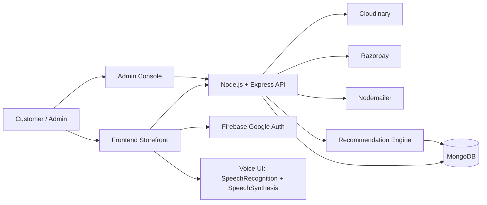
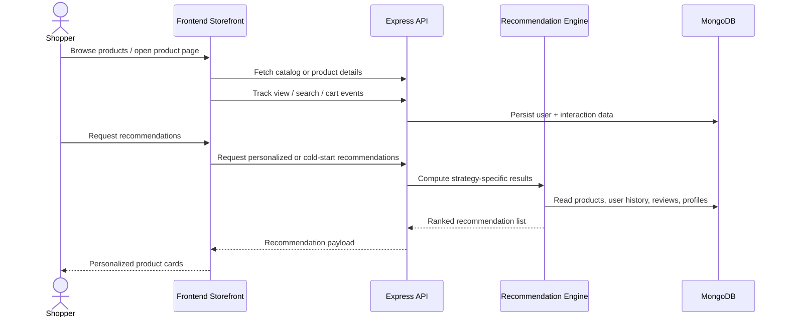

# OneCart E-Commerce + Recommendation System

[](https://nodejs.org/)
[](https://react.dev/)
[](https://vitejs.dev/)
[](https://expressjs.com/)
[](https://www.mongodb.com/)
[](LICENSE)

## Professional Overview

OneCart is a full-stack e-commerce platform with a separate admin console, a MongoDB-backed Node.js API, and an intelligent recommendation layer that blends content-based, collaborative, popularity, category, rating, and review-driven signals.

The application is designed to support a realistic production workflow: user authentication, product discovery, cart management, order placement, review collection, contact form handling, admin product/order management, and personalized recommendations driven by user behavior tracking.

This makes the project especially strong for portfolio review because it demonstrates product thinking, API design, state management, recommendation engineering, and a clean split between customer-facing and admin-facing experiences.

## Key Features

| Area | Highlights |
| --- | --- |
| Storefront | Home, collections, product detail pages, cart, checkout, order history, about, contact |
| Authentication | Email/password login, registration, Google login, OTP password recovery, cookie-based sessions |
| Cart & Orders | Cart add/update/remove, Razorpay checkout, order placement, order status tracking |
| Wishlist | Save/remove products for later, dedicated wishlist page, live count in nav |
| Coupons | Percentage/flat discount codes with min-order, max-discount-cap, expiry, and per-user usage limits — discount always recomputed server-side |
| Reviews | Product review creation and retrieval |
| Admin Console | Product CRUD, order management, coupon management, admin login |
| Recommendations | Hybrid recommendations, cold-start support, similar products, trending products, category-aware suggestions |
| Tracking | View, search, add-to-cart, purchase, recommendation click, and time-on-page tracking |
| AI Interaction | Voice-assisted navigation with browser speech recognition and speech synthesis |
| Media & Assets | Cloudinary-based image uploads and product media handling |
| Notifications | Contact form email delivery via Nodemailer |
| Security | Rate limiting on login/OTP routes, server-side order total recomputation, centralized error handling |

## Project Architecture

OneCart is implemented as a modular monolith with three major surfaces:

1. Frontend storefront for shoppers.
2. Admin dashboard for catalog and order operations.
3. Backend API that handles authentication, commerce, media, and recommendation intelligence.



### Backend Layer

The backend exposes route groups for auth, users, products, cart, orders, reviews, contact messages, legacy recommendations, and advanced ML recommendations.

### Frontend Layer

The customer app is a React + Vite SPA with reusable components, route guards, recommendation widgets, and behavior tracking hooks.

### Admin Layer

The admin app is a separate React + Vite interface dedicated to product creation, editing, listing, order review, and admin authentication.

## Tech Stack

| Layer | Technologies |
| --- | --- |
| Frontend | React 19, React Router DOM, Vite, Tailwind CSS v4, Axios, React Toastify, React Spinners, Lucide React, React Icons |
| Admin | React 19, Vite, React Router DOM, Tailwind CSS v4, React Toastify |
| Backend | Node.js, Express 5, MongoDB, Mongoose, JWT, bcryptjs, cookie-parser, CORS |
| Media | Multer, Cloudinary |
| Payments | Razorpay |
| Email | Nodemailer |
| Auth | Firebase Google sign-in, JWT-based sessions |
| Recommendation / ML | Hybrid recommendation engine, TF-IDF-style content similarity, user-user collaborative filtering, review-based collaborative filtering, popularity ranking, cold-start logic |

## System Design / Workflow



### Typical User Flow

1. A shopper signs in with email/password or Google.
2. The storefront loads product data and personalized recommendation blocks.
3. User interactions are tracked in the backend to improve ranking quality.
4. The shopper adds items to cart and completes checkout through Razorpay.
5. The backend clears the cart, stores the order, and updates analytics signals.
6. Admins manage catalog entries and order status from the admin console.


## Folder Structure

```text
OneCart E-commerce + Recommendation System/
├── frontend/                # Customer-facing React app
├── admin/                   # Admin React dashboard
├── backend/                 # Express API, controllers, models, services
└── README.md                # Project landing page
```

### Important Backend Areas

- `backend/controller` for route handlers.
- `backend/routes` for HTTP endpoints.
- `backend/model` for MongoDB schemas.
- `backend/services` for recommendation and event-tracking logic.
- `backend/config` for database, cloud, email, token, and recommendation settings.

### Important Frontend Areas

- `frontend/src/pages` for shopper screens.
- `frontend/src/component` for reusable UI pieces.
- `frontend/src/hooks` for tracking and recommendation hooks.
- `frontend/src/context` for auth and app state.

### Important Admin Areas

- `admin/src/pages` for dashboard screens.
- `admin/src/component` for admin UI components.
- `admin/src/context` for admin session state.

## Installation Guide

### Prerequisites

- Node.js 18 or newer
- MongoDB Atlas or local MongoDB instance
- Razorpay account for payment testing
- Cloudinary account for media uploads
- Firebase project for Google sign-in

### 1. Clone the repository

```bash
git clone <your-repo-url>
cd "OneCart E-commerce + Recommendation System"
```

### 2. Install dependencies

Install each app separately:

```bash
cd backend
npm install

cd ..\frontend
npm install

cd ..\admin
npm install
```

### 3. Configure environment variables

Create the required `.env` files as described below.

### 4. Start the backend

```bash
cd backend
npm run dev
```

### 5. Start the storefront

```bash
cd frontend
npm run dev
```

### 6. Start the admin console

```bash
cd admin
npm run dev
```

## Environment Variables

### Backend `.env`

| Variable | Purpose |
| --- | --- |
| `PORT` | Backend server port |
| `MONGODB_URL` | MongoDB connection string |
| `JWT_SECRET` | JWT signing secret |
| `ADMIN_EMAIL` | Admin login email |
| `ADMIN_PASSWORD` | Admin login password |
| `EMAIL` | Email account used for outbound mail |
| `EMAIL_PASS` | Email app password for SMTP |
| `CLOUDINARY_NAME` | Cloudinary cloud name |
| `CLOUDINARY_API_KEY` | Cloudinary API key |
| `CLOUDINARY_API_SECRET` | Cloudinary API secret |
| `RAZORPAY_KEY_ID` | Razorpay key ID |
| `RAZORPAY_KEY_SECRET` | Razorpay secret key |

### Frontend `.env`

| Variable | Purpose |
| --- | --- |
| `VITE_BACKEND_URL` | Optional backend base URL override |
| `VITE_FIREBASE_APIKEY` | Firebase web API key for Google sign-in |

### Admin `.env`

| Variable | Purpose |
| --- | --- |
| `VITE_BACKEND_URL` | Optional backend base URL override for the admin app |

## Running the Project

### Backend

```bash
cd backend
npm run dev
```

### Frontend

```bash
cd frontend
npm run dev
```

### Admin

```bash
cd admin
npm run dev
```

### Production-style start for backend

```bash
cd backend
npm start
```

## API Endpoints

Base backend URL: `http://localhost:8000`

### Auth

| Method | Endpoint | Purpose |
| --- | --- | --- |
| POST | `/api/auth/register` | Register a new user |
| POST | `/api/auth/login` | Login a user |
| POST | `/api/auth/googlelogin` | Google sign-in |
| POST | `/api/auth/adminlogin` | Admin login |
| POST | `/api/auth/send-otp` | Send password reset OTP |
| POST | `/api/auth/verify-otp` | Verify OTP |
| POST | `/api/auth/reset-password` | Reset password |
| POST | `/api/auth/logout` | Logout |

### Products

| Method | Endpoint | Purpose |
| --- | --- | --- |
| POST | `/api/product/addproduct` | Add a product with images |
| GET | `/api/product/list` | List all products |
| GET | `/api/product/:id` | Fetch a product by ID |
| POST | `/api/product/edit/:id` | Edit product details |
| POST | `/api/product/remove/:id` | Remove a product |

### Cart

| Method | Endpoint | Purpose |
| --- | --- | --- |
| GET | `/api/cart/get` | Get the current user's cart |
| POST | `/api/cart/add` | Add item to cart |
| PUT | `/api/cart/update` | Update cart item |
| DELETE | `/api/cart/remove` | Remove cart item |

### Orders

| Method | Endpoint | Purpose |
| --- | --- | --- |
| POST | `/api/order/placeorder` | Place a cash/standard order |
| POST | `/api/order/razorpay` | Create Razorpay order |
| POST | `/api/order/verifyrazorpay` | Verify Razorpay payment |
| POST | `/api/order/userorder` | Fetch user orders |
| POST | `/api/order/list` | Admin order list |
| POST | `/api/order/status` | Update order status |

### Wishlist

| Method | Endpoint | Purpose |
| --- | --- | --- |
| GET | `/api/wishlist/get` | Get the current user's wishlist |
| POST | `/api/wishlist/add` | Add a product to the wishlist |
| DELETE | `/api/wishlist/remove` | Remove a product from the wishlist |

### Coupons

| Method | Endpoint | Purpose |
| --- | --- | --- |
| POST | `/api/coupon/validate` | Preview a coupon's discount against the cart amount |
| POST | `/api/coupon/create` | Admin: create a coupon |
| GET | `/api/coupon/list` | Admin: list all coupons |
| PUT | `/api/coupon/toggle/:id` | Admin: enable/disable a coupon |
| DELETE | `/api/coupon/:id` | Admin: delete a coupon |

### Reviews

| Method | Endpoint | Purpose |
| --- | --- | --- |
| POST | `/api/review/add` | Add a product review |
| GET | `/api/review/product/:productId` | Get reviews for a product |
| GET | `/api/review/all` | Get all reviews |

### Contact

| Method | Endpoint | Purpose |
| --- | --- | --- |
| POST | `/api/contact/send` | Send contact form email |

### Legacy Recommendations

| Method | Endpoint | Purpose |
| --- | --- | --- |
| POST | `/api/recommendations/recommendations` | Get recommendations |
| POST | `/api/recommendations/recommendations/:strategy` | Strategy-specific recommendations |
| POST | `/api/recommendations/track-view` | Track product view |
| POST | `/api/recommendations/track-purchase` | Track purchase |
| POST | `/api/recommendations/user-preferences` | Get user preferences |

### Advanced ML Recommendations

| Method | Endpoint | Purpose |
| --- | --- | --- |
| POST | `/api/ml/recommendations` | Personalized ML recommendations |
| GET | `/api/ml/similar/:productId` | Similar products |
| GET | `/api/ml/trending` | Trending products |
| POST | `/api/ml/cold-start` | Cold-start recommendations |
| POST | `/api/ml/rating-based` | Rating-based recommendations |
| POST | `/api/ml/review-based` | Review-based recommendations |
| GET | `/api/ml/strategies` | Available strategies |
| POST | `/api/ml/track/view` | Track product view |
| POST | `/api/ml/track/search` | Track search |
| POST | `/api/ml/track/add-to-cart` | Track add-to-cart |
| POST | `/api/ml/track/purchase` | Track purchase |
| POST | `/api/ml/track/recommendation-click` | Track recommendation click |
| POST | `/api/ml/track/time-on-page` | Track dwell time |
| POST | `/api/ml/track/session-start` | Track session start |
| GET | `/api/ml/analytics/user/:userId` | User analytics |
| GET | `/api/ml/analytics/product/:productId` | Product analytics |
| GET | `/api/ml/analytics/overview` | Recommendation system overview |
| POST | `/api/ml/cache/clear` | Clear cache |
| POST | `/api/ml/recompute` | Recompute recommendations |

## Screenshots

> Placeholder section for future images.

| View | Placeholder |
| --- | --- |
| Home page | `./docs/screenshots/home.png` |
| Product detail | `./docs/screenshots/product-detail.png` |
| Cart and checkout | `./docs/screenshots/cart-checkout.png` |
| Admin dashboard | `./docs/screenshots/admin-dashboard.png` |
| Recommendation module | `./docs/screenshots/recommendations.png` |

## Future Improvements

- Add persistent caching for recommendation responses.
- Introduce a stronger analytics dashboard for behavior trends and conversion funnels.
- Add search indexing and semantic product discovery.
- Expand the recommendation system with session-aware and campaign-aware ranking.
- Add automated tests for critical API flows and recommendation ranking logic.
- Add deployment automation and environment-specific configuration templates.
- Introduce an optional LLM-powered shopping assistant for guided discovery and support.
- Allow local frontend/admin dev servers to call a local backend under CORS (currently only the two production Render origins are allowlisted).
- Migrate the remaining controllers (auth, product, cart, review, contact, recommendations) to the centralized `AppError`/error-handler pattern already used in `orderController` and `couponController`.

## Challenges Solved

- Separated shopper, admin, and backend concerns without forcing a microservices split too early.
- Implemented multiple recommendation strategies to handle both warm-start and cold-start users.
- Added real user-behavior tracking to improve personalization quality over time.
- Integrated media upload, payments, and email delivery into one consistent commerce flow.
- Supported Google sign-in and password recovery alongside traditional auth.
- Built a voice-assisted navigation layer that makes the UI more interactive.

## Learning Outcomes

- Designing a production-style full-stack commerce system.
- Structuring a React app with reusable components, contexts, and hooks.
- Building and documenting RESTful APIs with auth-protected routes.
- Connecting MongoDB models to behavioral recommendation logic.
- Handling third-party services such as Cloudinary, Firebase, Razorpay, and SMTP mail.
- Thinking about product quality from the perspective of both users and recruiters.

## Why This Project Stands Out

- It is not just a storefront; it is a commerce platform with personalization.
- It includes a dedicated admin experience alongside the customer experience.
- It demonstrates applied recommendation engineering, not just static content delivery.
- It captures real user events to improve ranking quality and future extensibility.
- It combines frontend UX, backend architecture, and product-level thinking in one system.

## License

This project is licensed under the ISC License.
